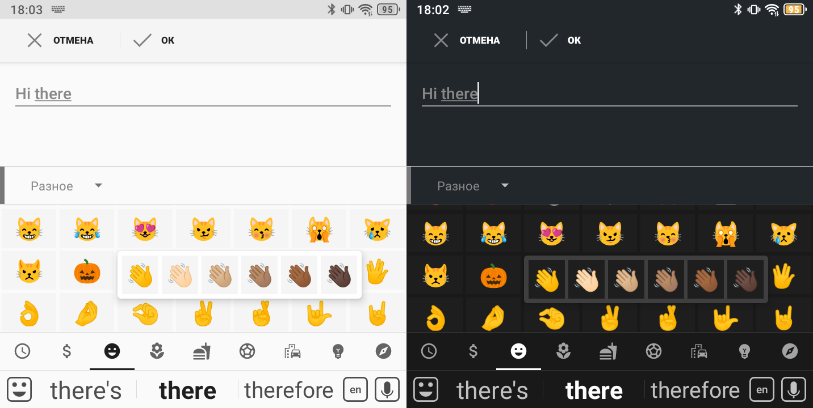
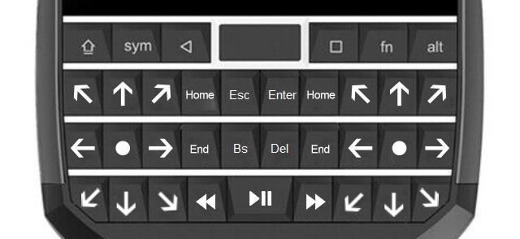

# PocketBoard IME

Tiny but powerful IME designed for [Unihertz Titan Pocket](https://www.kickstarter.com/projects/jellyphone/titan-pocket-the-smallest-qwerty-android-11-smartphone)
which makes this QWERTY keyboard smartphone a little more "keyboard"

# Key Features

* Auto-correction and word suggestions (requires external spellchecker, e.g. [OpenBoard SpellChecker](https://github.com/SinuXVR/openboard-spellchecker))
* User dictionaries support
* Auto-capitalization
* Inline autofill (Android 11+)
* Voice input (requires Google Voice Input (`com.google.android.googlequicksearchbox`))
* Emoji and special symbol palettes
* D-Pad and media keys emulation
* Incoming call accept/decline using shift/alt physical keys
* Virtual Touchpad

# Keyboard shortcuts

* `SHIFT` (short press) - toggle SHIFT state or accept incoming call (disabled by default)
* `SHIFT` + `KEY` - print KEY in upper case
* `ALT` (short press) - toggle ALT state or decline incoming call (disabled by default)
* `ALT` + `KEY` - print KEY alternate value
* `ALT` + `SHIFT` or `SPACE` (hold) - switch to the next keyboard layout (input method)
* `CTRL` + `ALT` - launch voice input
* `CTRL` + `KEY` - some default CTRL shortcuts (e.g. `CTRL` + `V`)
* `SYM` (short press) - toggle emoji panel visibility
* `SYM` + `KEY` - run `SymPad` action
* `SYM` (hold) - enable and lock `SymPad` mode

_Tip:_ to enable incoming call accept/decline feature go to the PocketBoard settings, turn on `Phone control`
and grant the required permission

_Tip:_ to print an alternate key value, you can simply hold down that key

_Tip:_ some keys have more than one alternate (and main) value. You can iterate over these values by quickly pressing the key

## SymPad actions

`SymPad` is a keyboard mode that simulates additional hardware key events:

* `Q`, `W`, `E`, `A`, `S`, `D`, `Z`, `X`, `C` or `I`, `O`, `P`, `K`, `L`, `Del`, `N`, `M`, `Ent` - 9-positional D-Pad
* `R` or `U` - Home
* `F` or `J` - End
* `T` - Escape
* `Y` - Enter
* `G` - Backspace
* `H` - Del (forward delete)
* `V` - previous track (short press) or rewind (hold)
* `SPACE` - Play/Pause
* `B` - next track (short press) or fast forward (hold)

_Tip:_ to lock keyboard in `SymPad` mode you need to hold down the `SYM` key for about 2-3 seconds. When `SymPad` mode
lock is active, the `<S>` icon is displayed in the status bar. To back to normal mode just press `SYM` again.

_Tip:_ you can use `D-Pad`, `Home` and `End` keys simulation to move cursor in text fields, scroll through pages in the
browser, etc. Using `D-Pad` and `SHIFT` you can also select text in a text editor

_Notice:_ some modern applications don't support `D-Pad` events and many music/video player applications do not
support fast forward/rewind events

# Supported languages and layouts

* English
    * US (QWERTY)
* Русский
    * Транслит
    * BB Passport
* Español (España)

# Known bugs

* Digits duplication in Telegram login fields on Android < 15

  _Workaround:_ use additional symbols palette (press `SYM` and go to the `$` tab) to enter phone and confirmation number

* Inline suggestions password selection dialog don't appear on Android < 15

  _Workaround:_ before clicking on `Passwords` suggestion press `SYM` to open emoji panel. Then you can pick `Passwords`
  suggestion and everything should work as expected
